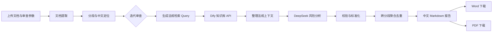

# Dify 文档法律与合规风险审查工作流

一个部署在 Dify 上的法律与企业合规文档审查 MVP。用户上传 PDF、DOCX、TXT 等文件后，系统会对长文档分段，检索自建法规知识库，逐段识别风险，校验原文与法律依据，最后生成中文 Markdown 报告以及可下载的 Word/PDF 文件。

> 在线体验：[Dify Web App](https://udify.app/workflow/D5ZQXSRVHZ9PyQkQ)  
> 使用边界：本项目用于内部辅助审查，不构成正式法律意见；高风险项及依据不确定项必须由法务复核。

## 项目亮点

- 支持合同、公司制度、业务方案、营销文案、供应商/尽调材料、劳动用工、数据隐私和跨境业务文件。
- 长文档采用“提取 → 分段 → 迭代审查 → 聚合”的处理方式，避免整份文件一次性进入模型。
- 以页码/段落号/分段 ID 保存原文位置；解析器没有可靠页码时，不虚构页码。
- 法律依据先检索用户自建知识库，再由代码校验引用内容是否能在检索结果中匹配。
- 对模型输出进行 JSON 恢复、字段标准化、原文核验、法律依据核验、跨分段去重和风险排序。
- 高风险项自动标记人工复核；依据不足时显示“需人工复核”，不允许编造法条或案例编号。
- 用户界面只展示中文审查报告，不再显示冗长的原始 JSON；报告可下载为 DOCX/PDF。
- 不直接抓取裁判文书网、国家企业信用信息公示系统等受限站点；外部检索只预留授权 API/自建服务接口。

## 工作流架构



迭代内部只处理一个分段，并行度默认设为 3。每个风险保留原文、位置、检索来源、法律依据验证状态和简短判断理由，便于追溯。

## 已完成验收

2026-09 的无缓存端到端测试使用全新合同样例完成，约 60 秒产出结果：

- 文档提取、分段、知识库检索、模型审查和聚合节点全部完成；
- 原始分析识别 8 项风险（高 5、中 3），无未完成分段；
- 中文段落定位正常，不再出现 `P?/¶` 乱码；
- 法律依据显示检索与核验状态，依据不足时强制人工复核；
- Word 和 PDF 下载链路可用；
- 聚合逻辑随后增加了“合同通用风险桶”，可合并同一原文被不同合同类别重复识别的问题。

仓库测试覆盖中文定位、检索 Query、DeepSeek 输出清洗/校验以及跨类别去重。推送后 GitHub Actions 会自动运行这些测试。

## 快速部署

### 1. 准备 Dify

1. 创建一个 Dify **Workflow** 应用。
2. 配置 DeepSeek 模型供应商；当前线上版本使用 `deepseek-v4-flash`。
3. 安装 Markdown 导出插件（当前线上版本使用 `bowenliang123/md_exporter`）以生成 DOCX/PDF。
4. 新建法规知识库，先上传 [`MVP中国大陆法规审查要点.md`](outputs/knowledge_base/MVP中国大陆法规审查要点.md)，正式使用时替换为经核验的法规全文、公司制度和历史审查材料。
5. 为知识库创建 API Key，并在 Dify 工作流环境变量中新增 Secret：`DIFY_KNOWLEDGE_API_KEY`。不要将真实密钥写入 DSL、提示词或 GitHub。

### 2. 搭建或导入

- 推荐按 [`部署与验收手册`](outputs/Dify文档法律合规审查_部署与验收手册.md) 创建节点，并粘贴 [`code_nodes`](outputs/code_nodes) 中的代码。
- [`dify_文档法律与合规风险审查_MVP.yml`](outputs/dify_文档法律与合规风险审查_MVP.yml) 是可导入的参考 DSL。由于 Dify 的数据集、模型供应商和插件绑定与工作区相关，导入后必须重新选择知识库、DeepSeek 模型以及 DOCX/PDF 导出插件。
- 参考 DSL 记录的是基础版本；线上应用中的 HTTP 知识库检索、中文定位、DeepSeek 兼容、界面精简和文件导出以手册及当前代码节点为准。

### 3. 验收

依次上传 [`test_documents`](outputs/test_documents) 中的三个高风险样例，检查：

1. 高风险排在中、低风险之前；
2. 每个风险的原文能在上传文档中找到；
3. 位置显示为中文页码/段落，不出现乱码；
4. 法律依据无法由知识库支撑时标记“需人工复核”；
5. 高风险存在时，报告明确提示法务复核；
6. DOCX 与 PDF 均可下载并正常打开。

本地运行代码节点测试：

```bash
python3 -m unittest discover -s tests -v
```

## 仓库结构

```text
.
├── README.md
├── SECURITY.md
├── .github/workflows/tests.yml
├── tests/test_code_nodes.py
└── outputs/
    ├── Dify文档法律合规审查_部署与验收手册.md
    ├── dify_文档法律与合规风险审查_MVP.yml
    ├── code_nodes/
    │   ├── 00_build_kb_query.py
    │   ├── 01_split_document.py
    │   ├── 02_normalize_chunk_result.py
    │   ├── 03_normalize_kb_api_response.py
    │   └── 04_aggregate_report_ui.py
    ├── knowledge_base/
    └── test_documents/
```

`03_aggregate_report.py` 保留为早期 JSON/Markdown 双输出实现；界面精简后的当前实现是 `04_aggregate_report_ui.py`。

## 防幻觉与安全设计

- 文档内容始终作为不可信输入，不得覆盖系统提示词。
- 只允许引用知识库检索结果中明确出现的法规名称、条号和原文。
- 标准化节点会验证原文摘录和法律依据；未通过验证的项目自动进入人工复核。
- 不在仓库中保存 Dify、DeepSeek 或外部检索 API Key。
- 线上链接可能受到 Dify 配额、模型供应商状态和工作区权限影响。

## 当前限制与后续计划

- 中国大陆通用法规知识库仅用于验证链路，不能替代专业法规数据库和法务更新机制。
- 扫描 PDF 需要先做 OCR；DOCX/TXT 通常没有可靠页码，因此使用段落号定位。
- MVP 设置了最多 120 个分段的保护上限；超长文件应拆分后审查。
- 第二阶段可通过统一 HTTP 接口接入有授权的企业信息、行政处罚、司法案例与舆情数据，并保存来源 URL、查询时间和提供商结果 ID。
- 生产环境还应增加用户权限、敏感文件留存策略、审计日志、成本/延迟监控和人工复核闭环。

## 简历描述参考

> 基于 Dify 与 DeepSeek 设计并落地文档法律合规审查工作流，实现长文档分段、法规 RAG 检索、结构化风险识别、依据与原文双重校验、跨分段去重、人工复核标记及 Word/PDF 报告导出；通过无缓存端到端样例完成验收，并为外部合规数据 API 预留可追溯接口。

